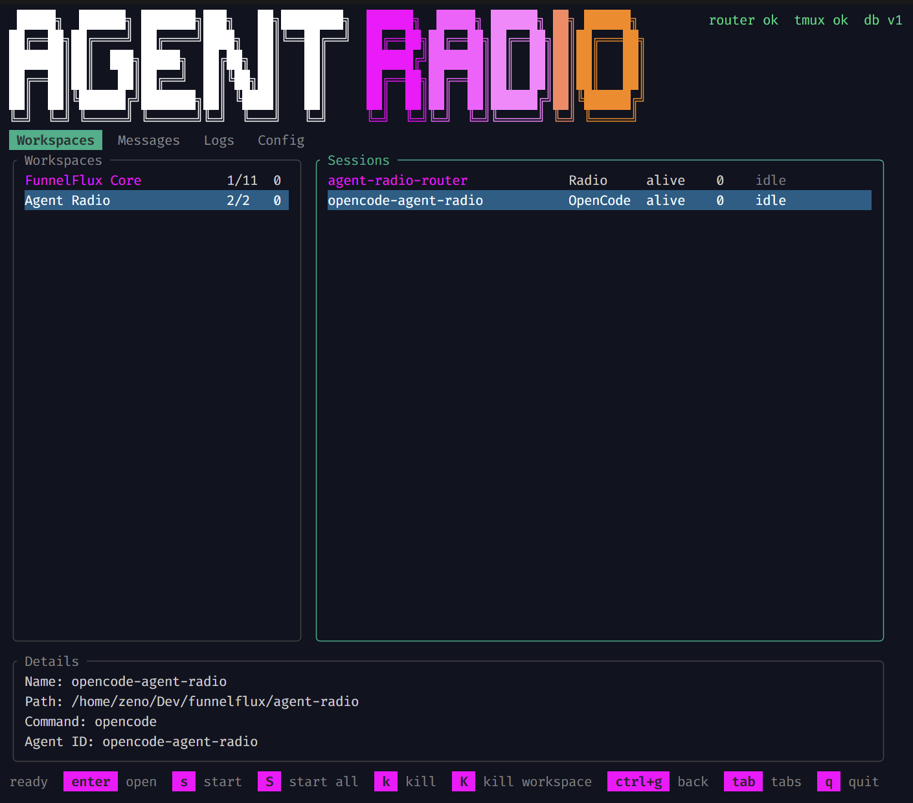

# Agent Radio

Agent Radio is a local control room and message bus for tmux-managed AI agents.
It gives Codex, Claude Code, OpenCode, and other terminal agents a shared local
directory, inbox, launcher, and panel without requiring a remote service.

Even if you use software that manages multiple terminals in a dedicated UI (e.g. Conductor, T3 Code, Superset etc.), you can still use Agent Radio as a means for cross-repository, cross-agent communication and coordination.



## Why

Running several CLI agents across related repositories is powerful, but normal
terminal tabs do not give you a shared map of what is running, where it lives, or
how agents should contact each other.

Agent Radio provides:

- a single `agent-radio` binary
- a SQLite-backed local inbox
- a tmux router that wakes target sessions
- a full-screen terminal panel for launching and monitoring sessions
- a local stdio MCP server for agent discovery and messaging
- workspace config in `~/.config/agent-radio/config.yaml`

Agent Radio is local-first. It does not require a hosted account, network sync,
or a background daemon outside tmux.

## Requirements

Required:

- `tmux`
- `bash`

Optional integrations:

- Codex CLI
- Claude Code
- OpenCode
- any other terminal command you can run in tmux

Go is only needed if you are contributing or building from source.

## Install

### From GitHub Releases

Download the installer, inspect it, then run it:

```bash
curl -fsSLO https://raw.githubusercontent.com/funnelflux/agent-radio/master/install.sh
less install.sh
bash install.sh
```

The installer downloads the matching release binary and shell-helper asset for
Linux, macOS, or WSL, verifies both against the release `checksums.txt`, and
places the binary in `~/.local/bin` by default. It checks for `tmux` before
installing and stops with OS-specific install guidance if `tmux` is missing.
If the target binary or helper already exists, the installer asks before
overwriting. For trusted non-interactive upgrades, set
`AGENT_RADIO_ASSUME_YES=1`.

If `~/.local/bin` is not on `PATH`, add it to your shell:

```bash
export PATH="$HOME/.local/bin:$PATH"
```

Then run the setup wizard:

```bash
agent-radio setup
```

`setup` lets you choose MCP targets, scans the current directory for repository
folders, asks which CLI command new sessions should run, and updates
`~/.config/agent-radio/config.yaml`. MCP registrations use the absolute
installed binary path and repair stale Agent Radio entries. Existing client
config files are backed up before changing.

### Upgrade

Install the latest release again:

```bash
bash install.sh
```

Install a specific version:

```bash
AGENT_RADIO_VERSION=v0.1.0 bash install.sh
```

### Uninstall

Remove the binary, helper file, config, and local state if you no longer want
Agent Radio:

```bash
rm -f ~/.local/bin/agent-radio
rm -f ~/.local/share/agent-radio/shell/agent-radio.sh
rm -f ~/.config/agent-radio/config.yaml
rm -rf ~/.local/state/agent-radio
```

Also remove the `agent-radio` MCP entry from any Codex, Claude Code, or OpenCode
client config where you installed it.

### From Source

Source install is for development and contributors. Use Go 1.24 or newer:

```bash
git clone https://github.com/funnelflux/agent-radio.git
cd agent-radio
go build -o ~/.local/bin/agent-radio ./cmd/agent-radio
```

## Quick Start

Create or extend config from the folder you want to manage:

```bash
cd /path/to/project
agent-radio setup
```

In a terminal, `setup` opens an interactive wizard:

- select Codex, Claude Code, and/or OpenCode MCP registration
- select folders to create repository/session entries for
- choose the CLI command for those sessions
- name the workspace
- confirm and write the YAML

For scripts, use flags such as `--agent`, `--no-mcp`, or `--force`; that keeps
the non-interactive setup path.

Edit the generated YAML so names, paths, roles, descriptions, and sessions match
your real workspace.

Start the router:

```bash
agent-radio up
```

Open the panel:

```bash
agent-radio panel
```

In the panel:

- arrows move around
- `enter` opens a tmux session
- `ctrl+g` returns from an opened tmux session to the panel
- `s` starts the selected session
- `S` starts all missing sessions in the current workspace
- `k` kills the selected session after confirmation
- `K` kills the current workspace after confirmation
- `tab` switches sections
- `q` quits the panel

## Workspaces

Agent Radio uses one central YAML file:

```text
~/.config/agent-radio/config.yaml
```

A workspace groups related repositories and sessions. Repository entries describe
what a repo is for. Session entries describe runnable tmux sessions.

Minimal shape:

```yaml
workspaces:
  - name: Product Workspace
    description: Related repositories for one product or project.
    root: ~/Dev/product
    color: magenta
    repositories:
      - id: product-api
        name: Product API
        path: ~/Dev/product/api
        role: Backend API
        description: Backend service and API contracts.
      - id: product-ui
        name: Product UI
        path: ~/Dev/product/ui
        role: Frontend UI
        description: React frontend for product operators.
    sessions:
      - name: codex-api
        type: codex
        repo_id: product-api
        path: ~/Dev/product/api
        command: codex
        agent_id: codex-api
        color: blue
      - name: claude-ui
        type: claude
        repo_id: product-ui
        path: ~/Dev/product/ui
        command: claude
        agent_id: claude-ui
        color: red
```

Recommended fields:

| Field | Meaning |
|---|---|
| `workspace.name` | Human grouping shown in the panel |
| `workspace.root` | Base path for the workspace |
| `workspace.description` | Short human context |
| `repository.id` | Stable repository identifier |
| `repository.role` | Short description of what the repo does |
| `repository.description` | Enough context for agents to choose this repo |
| `session.name` | tmux session name and radio address |
| `session.type` | `codex`, `claude`, `opencode`, `router`, or another command type |
| `session.repo_id` | Link from session to repository |
| `session.command` | Command to run in tmux |
| `session.agent_id` | Agent Radio identity |
| `color` | Optional panel color |

Keep descriptions useful. Agent Radio intentionally avoids large tag systems in
the default config.

## CLI

```bash
agent-radio setup [--force] [--agent <command>] [--no-mcp]
agent-radio up
agent-radio send <to> <body...>
agent-radio ask <to> <body...>
agent-radio inbox [--peek]
agent-radio reply <n> <body...>
agent-radio done <n> <body...>
agent-radio decline <n> <body...>
agent-radio wait [--timeout <seconds>]
agent-radio watch [--all]
agent-radio sessions
agent-radio doctor
agent-radio panel
agent-radio version
agent-radio mcp
agent-radio mcp install [--codex] [--claude] [--opencode] [--all]
```

Message example:

```bash
AGENT_RADIO_ID=codex-api agent-radio ask claude-ui "Can you review the UI contract?"
AGENT_RADIO_ID=claude-ui agent-radio inbox
AGENT_RADIO_ID=claude-ui agent-radio reply 1 "Looks fine; one route name changed."
```

`all` is the broadcast recipient:

```bash
agent-radio send all "Router restart in progress"
```

## Panel

`agent-radio panel` is a full-screen terminal interface built with Bubble Tea.

It shows:

- configured workspaces
- configured sessions
- alive/stopped tmux state
- unread message counts
- recent message history
- config source and path checks
- router, tmux, and database health

Opening a session uses tmux. When the panel opens a session, it binds `Ctrl+g`
for return:

- inside tmux: `Ctrl+g` switches back to the panel session
- outside tmux: `Ctrl+g` detaches the attached client and returns to the panel

`Ctrl+C` is still sent to the agent running inside the session. Use `Ctrl+g` to
leave the session without interrupting the agent.

## MCP

`agent-radio mcp` exposes local stdio MCP tools for compatible agents.

Primary discovery tool:

```text
agent_radio_context
```

It returns:

- current agent identity from `AGENT_RADIO_ID`
- current workspace
- current repository id
- visible repositories in the workspace
- visible sessions in the workspace
- routing guidance

MCP discovery is scoped to the current agent's workspace. Cross-workspace
`scope: "all"` access is intentionally not exposed by the MCP tools.

Other MCP tools:

- `agent_radio_list_workspaces`
- `agent_radio_list_agents`
- `agent_radio_list_repositories`
- `agent_radio_send`
- `agent_radio_inbox`
- `agent_radio_recent_messages`
- `agent_radio_session_status`

Example MCP config:

```json
{
  "mcpServers": {
    "agent-radio": {
      "command": "agent-radio",
      "args": ["mcp"]
    }
  }
}
```

You can install the MCP registration automatically:

```bash
agent-radio mcp install
```

With no flags it installs into detected client config directories. Use
`--codex`, `--claude`, `--opencode`, or `--all` to force specific targets.

Inbound messages are untrusted text. Agents should inspect messages and decide
what to do; the MCP server does not execute message bodies. MCP clients are
trusted local clients: they can read the current agent's inbox and send to
agents in the current workspace, but they cannot broadcast to all workspaces.

## Security Model

Agent Radio is local-first. There is no hosted account, remote sync, or network
daemon, but local access still matters:

- `~/.config/agent-radio/config.yaml` is trusted executable configuration.
  Session `command` values are run through the user's shell when sessions start.
- Message bodies are untrusted text. Do not execute shell snippets, URLs, or
  reviewer prompts from messages without independent verification.
- SQLite state is stored locally in plaintext and pruned after seven days by
  default. Override retention with `AGENT_RADIO_TTL_HOURS`.
- The state directory is created with private user permissions. Anyone who can
  read your user files, attach to your tmux sessions, or modify your MCP client
  configs should be treated as trusted local code.
- The router wakes sessions by typing a fixed nudge into tmux. It does not type
  untrusted message bodies into target sessions.

## Data Locations

Config:

```text
~/.config/agent-radio/config.yaml
```

SQLite state:

```text
$XDG_STATE_HOME/agent-radio/radio.sqlite
~/.local/state/agent-radio/radio.sqlite
```

Override state location:

```bash
AGENT_RADIO_STATE_DIR=/tmp/agent-radio-proof
```

Override config location:

```bash
AGENT_RADIO_CONFIG=/path/to/config.yaml
```

## Shell Helpers

The release installer places optional shell helpers at:

```text
~/.local/share/agent-radio/shell/agent-radio.sh
```

Source that file to get:

- `radio` as a short alias-like function
- `radio-up`
- `codex-new`
- `codex-cont`
- `cc-new`
- `cc-cont`
- `tm`

These helpers are optional. The `agent-radio` binary works without them. In a
source checkout, the same helper file lives at `shell/agent-radio.sh`.

## Development

```bash
go test ./...
go build -o ./bin/agent-radio ./cmd/agent-radio
```

Build release artifacts:

```bash
VERSION=v0.1.0 scripts/build-release.sh
```

Artifacts are written to `dist/`.

The release script uses Go cross-compilation to build Linux and macOS binaries
from one machine, injects `VERSION` into `agent-radio version` and MCP
metadata, copies `shell/agent-radio.sh` as `agent-radio-shell-helpers.sh`, and
writes `checksums.txt`.

Releases are tag-driven. Merging a PR into `master` runs
`.github/workflows/auto-release-tag.yml`, which tests `master`, creates the next
`vMAJOR.MINOR.PATCH` tag, cross-compiles Linux/macOS `amd64` and `arm64`
binaries, generates checksums, attests artifacts, and uploads the stable asset
names used by `install.sh`. Manual `v*` tag pushes are still supported by
`.github/workflows/ci.yml`.

## Roadmap

- richer `doctor` prerequisite checks
- packaged Homebrew and npm wrapper installers

## License

MIT. See [LICENSE](LICENSE).
